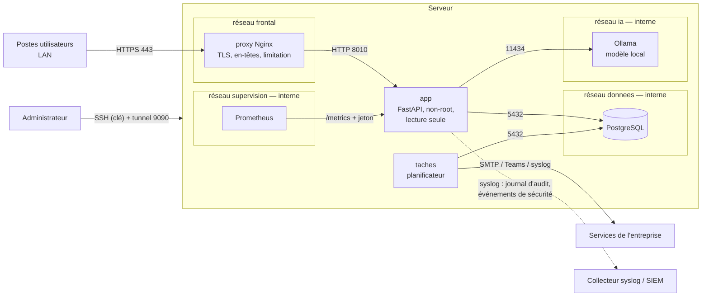

# Déploiement segmenté, durcissement et supervision

Axes R1 (déploiement), R3 (supervision) et R4 (durcissement) du mémoire. Deux modes sont possibles :

- **Conteneurs (recommandé)** : `docker-compose.yml` à la racine du projet ;
- **Sans conteneurs** : service systemd durci (`durcissement/rapports-esay.service`), voir `INSTALLATION.md`.

## Architecture réseau



### Matrice des flux autorisés

| Source | Destination | Port | Motif | Ailleurs |
|---|---|---|---|---|
| Postes du LAN | proxy | 443 (80 → redirection) | Utilisation de la plateforme | refusé par le pare-feu hôte |
| proxy | app | 8010 | Mandataire inverse | — |
| app | db | 5432 | Base de données | db : aucun autre flux, ni entrant ni sortant |
| app | llm | 11434 | Rédaction par le modèle local | llm : aucun accès internet (réseau interne) |
| prometheus | app | 8010 `/metrics` | Collecte des métriques (jeton) | `/metrics` renvoie 404 via le proxy |
| taches | SMTP, Teams, syslog | 587, 443, 514 | Notifications, ancre du journal | — |
| Postes d'administration | hôte | 22 | Administration (clé SSH) | refusé ailleurs |

**Principe** : seul le proxy publie des ports. `internal: true` interdit aux réseaux `donnees`, `ia` et
`supervision` toute sortie vers l'extérieur : une base ou un modèle compromis ne peut pas exfiltrer de données.

### Mesures d'isolement des conteneurs

| Mesure | proxy | app / taches | db | llm | prometheus |
|---|---|---|---|---|---|
| Système de fichiers en lecture seule | ✔ | ✔ | ✔ | — | ✔ |
| Utilisateur non privilégié | nginx (après démarrage) | `rapports` (uid 10001) | postgres | — | nobody |
| Capacités Linux | 4 (liaison 80/443) | aucune | 5 (initialisation) | aucune | aucune |
| `no-new-privileges` | ✔ | ✔ | ✔ | ✔ | ✔ |
| Limites mémoire / CPU | — | 2 Go / 2 CPU | 1 Go | 12 Go | — |

## Mise en service (conteneurs)

```bash
cp deploiement/.env.example deploiement/.env && chmod 600 deploiement/.env   # renseigner les secrets
sh deploiement/scripts/certificat-interne.sh rapports.esay.local             # ou certificat de l'autorité interne
python3 -c "import secrets; print(secrets.token_urlsafe(32))" > deploiement/supervision/jeton_metriques
#   → reporter la même valeur dans METRIQUES_JETON (deploiement/.env)
docker compose --env-file deploiement/.env build
docker compose --env-file deploiement/.env up -d
docker compose --env-file deploiement/.env exec app python gerer.py creer-admin prenom.nom@esay.ci "Prénom Nom"
sh deploiement/scripts/verifier-deploiement.sh https://rapports.esay.local
```

Options : `--profile ia` (modèle de langage local), `--profile supervision` (Prometheus sur `127.0.0.1:9090`,
accessible par `ssh -L 9090:127.0.0.1:9090 serveur`).

**Reprise des données existantes** : `outils_dev/exporter_sql.py` sur l'ancienne base, puis
`docker compose exec -T db psql -U rapports rapports_esay < donnees_locales.sql`, et copie des fichiers dans le
volume `donnees` (`docker compose cp`).

**Modèle de langage hors ligne** : le conteneur `llm` n'a pas d'accès internet. Charger le modèle une fois depuis
un poste connecté (`ollama pull <modèle>`), puis copier le dossier des modèles dans le volume `modeles`.

## Durcissement du serveur (R4)

| Fichier | Rôle |
|---|---|
| `durcissement/sshd-durcissement.conf` | SSH par clé uniquement, pas de root, algorithmes modernes, groupe autorisé |
| `durcissement/pare-feu.nft` | nftables : refus par défaut ; HTTPS depuis le LAN, SSH depuis les postes d'administration |
| `durcissement/fail2ban-rapports.conf` | Bannissement réseau après échecs de connexion à la plateforme |
| `durcissement/rapports-esay.service` | Service systemd durci (mode sans conteneurs) |

## Supervision (R3)

- **Métriques** (`/metrics`, format Prometheus, jeton) : requêtes et durées par modèle de route, analyses de fichiers,
  rapports, alertes ouvertes, imports en attente, intégrité du journal d'audit. Règles d'alerte :
  `supervision/regles.yml` (indisponibilité, journal compromis, erreurs, lenteurs, tentatives de connexion).
- **syslog / SIEM** (`SYSLOG_HOTE`) : chaque ligne du journal d'audit, **avec son empreinte**, émise après validation
  de la transaction ; événements de sécurité (`evenement=echec_connexion ip=…`) ; ancre quotidienne
  (`gerer.py ancre-journal`).
- **Détection de troncature** : `gerer.py verifier-journal --ancre <empreinte conservée dans le SIEM>` échoue (code 3)
  si des lignes ont été supprimées après cette ancre.

## Mesures pour le mémoire

`sudo sh deploiement/scripts/audit-securite.sh avant` puis, après durcissement, `… apres` : Lynis (indice de
durcissement), `systemd-analyze security`, Docker Bench, testssl.sh, bandit, pip-audit et la vérification du
déploiement, rangés dans `audits/<date>-<étiquette>/`.
